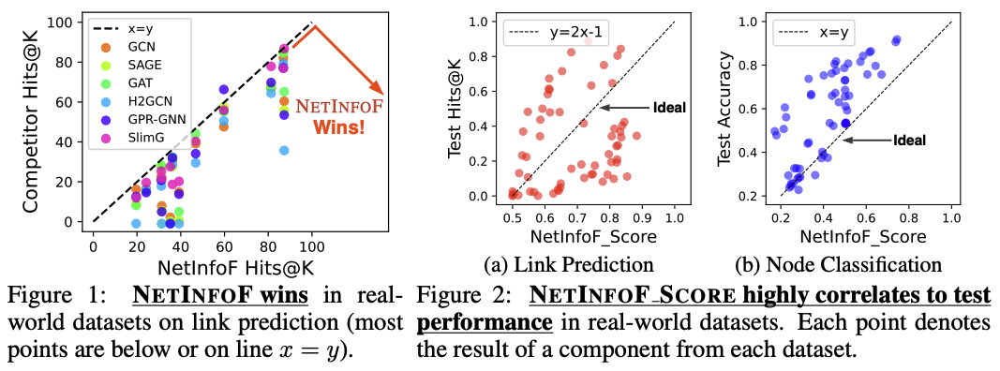
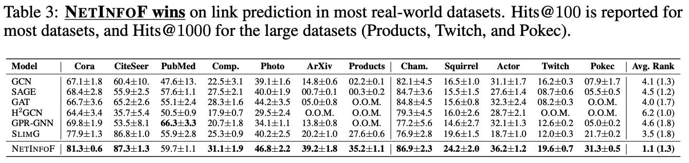

# NetInfoF Framework: Measuring and Exploiting Network Usable Information

Lee, M.C., Yu, H., Zhang, J., Ioannidis, V.N., Song, X., Adeshina, S., Zheng, D., and Faloutsos, C., “NetInfoF Framework: Measuring and Exploiting Network Usable Information”. International Conference on Learning Representations (ICLR), 2024. (Spotlight)

https://openreview.net/forum?id=KY8ZNcljVU

Please cite the paper as:

    @inproceedings{
      lee2024netinfof,
      title={NetInfoF Framework: Measuring and Exploiting Network Usable Information},
      author={Meng-Chieh Lee and Haiyang Yu and Jian Zhang and Vassilis N. Ioannidis and Xiang song and Soji Adeshina and Da Zheng and Christos Faloutsos},
      booktitle={The Twelfth International Conference on Learning Representations},
      year={2024},
      url={https://openreview.net/forum?id=KY8ZNcljVU}
      }

## Introduction
Given a graph with node features, how to tell if a graph neural network (GNN) can perform well on graph tasks or not? 
How can we know what information (if any) is usable to the tasks, namely, link prediction and node classification?

We propose Network Usabel Info Framework (NetInfoF), a framework to measure and exploit network usable information (NUI) in a given graph.
It composed of two parts:
1. **NetInfoF_Probe**: measures NUI of the given graph with NetInfoF_Score, and
2. **NetInfoF_Act**: solves both the link prediction and node classification by sharing the same backbone with NetInfoF_Probe.

In summary, NetInfoF has following advantages:
1. **General**, handling both node classification and link prediction;
2. **Principled**, with theoretical guarantee and closed-form solution;
3. **Effective**, thanks to the proposed adjustment of node similarity;
4. **Scalable**, scaling linearly with the input size.

## Experiments
NetInfoF is evaluated on 7 homophily and 5 heterophily real-world graphs, as well as 3 ogbl datasets.

## Usage

1. Install required packages:
   
`pip install -r requirements.txt`

2. Compile C++ random walk code:
   
`g++ -O3 -Wall -shared -std=c++11 -fPIC $(python3 -m pybind11 --includes) src/rwcpp.cpp -o src/rwcpp$(python3-config --extension-suffix)`

3. Run NetInfoF:

`bash run.sh`

or

`python src/main.py --dataset cora --hitK 100 --T 200 --print_probe True`

## Details
The code in this repository focuses on solving link prediction.

`src/main_ours.py`: is used to train NetInfoF.

`src/main_batch.py`: is used to train NetInfoF with mini-batch on large graphs.
